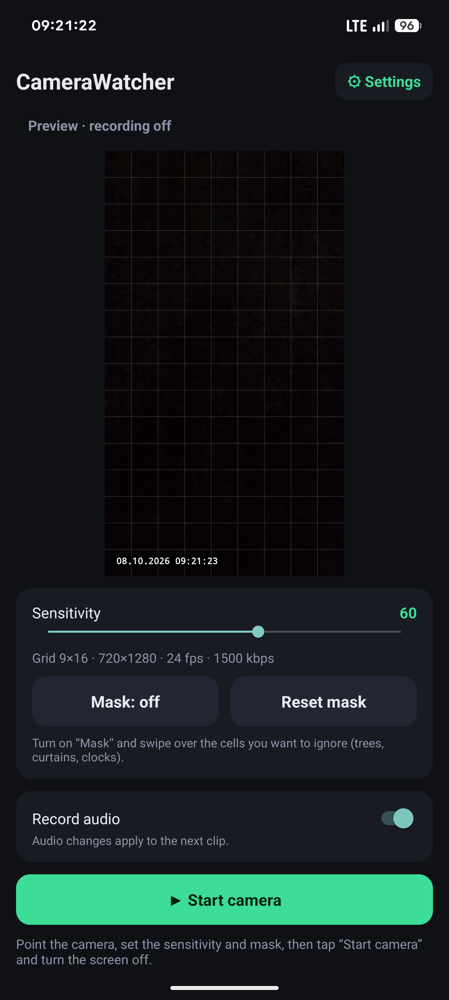
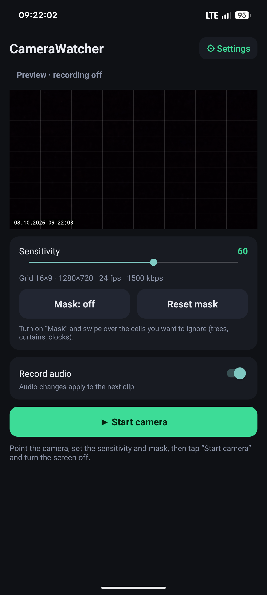
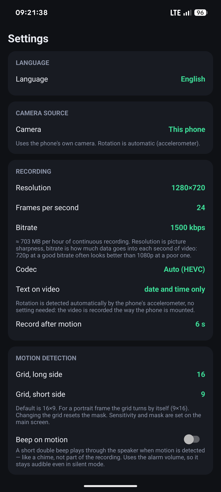
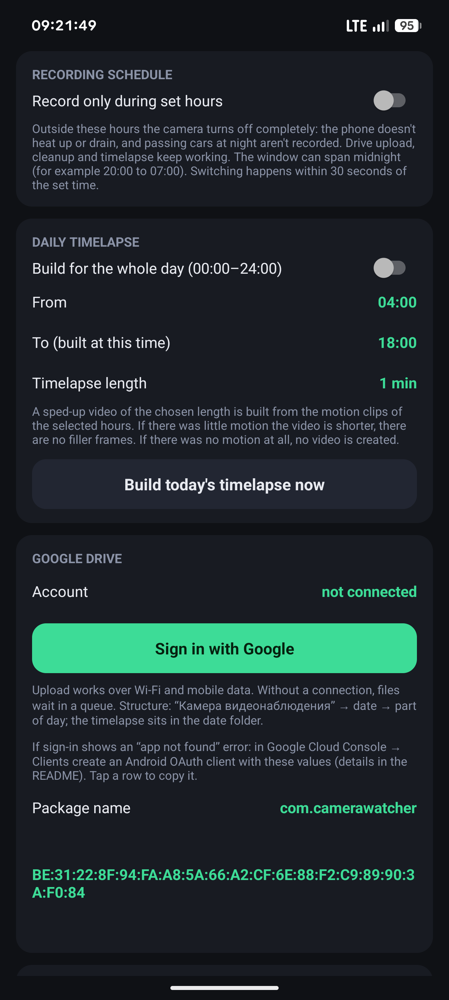
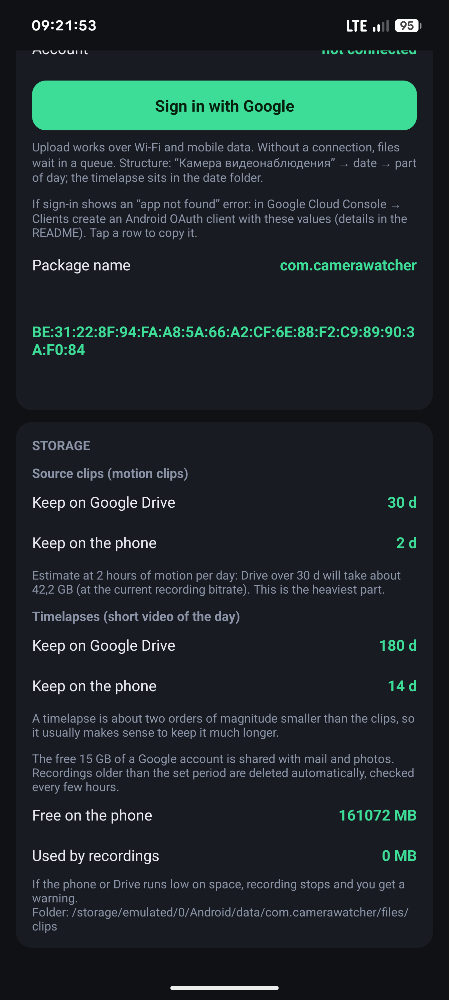

# CameraWatcher

**English** · [Русский](README.ru.md) · [Українська](README.uk.md)

Turn an old Android phone into a motion-activated security camera. It records a video clip only when something moves, uploads clips to **your own** Google Drive and builds a short timelapse of the day. No ads, no analytics, no servers of ours.

  
  
  
  
  

## Features

- **Motion detection on a grid.** 16×9 by default, up to 32 cells on the long side. Adjustable sensitivity and a mask you paint with a finger to ignore trees, curtains, clocks.
- **Steady frame rate.** Video is encoded by the hardware encoder straight from the camera, and resolution, FPS (16 / 24 / 30 / 60, only what your camera supports) and bitrate are chosen separately. HEVC when the phone has a hardware encoder, H.264 otherwise. Audio is optional.
- **Date and time on the video**, white on black, plus your own text (for example “Yard”).
- **Camera source.** This phone's own camera, or a USB webcam connected via an OTG adapter — pick it in Settings. Experimental: UVC webcam support varies a lot between models and is not tested on real hardware by the developer. The webcam's rotation is set manually (it is not mounted to the phone, so there is no accelerometer to read).
- **Motion beep.** An optional short double beep through the speaker when motion is detected, on the alarm volume so it's audible even in silent mode.
- **Auto rotation.** The video is recorded the way the phone is mounted (detected by the accelerometer). The preview follows the phone while you position it.
- **Recording schedule.** Record only in set hours; outside them the camera is fully off (good for old phones and for night traffic).
- **Daily timelapse** for the whole day or for set hours, 15 seconds to 10 minutes long. It is built from key frames without re-encoding, so it is fast and does not heat the phone.
- **Google Drive upload** into `date / part of day` folders. Sign-in goes through Google Play Services and the app can only touch files it created itself (`drive.file`).
- **Retention.** Separate number of days for source clips and for timelapses, on the phone and on Drive.
- **Runs in the background** as a foreground service with a watchdog. Stops safely when the phone or Drive is almost full.
- **English, Russian, Ukrainian** interface. Follows the system language, can be changed in Settings.

## Install

1. Download `CameraWatcher-x.y.z.apk` from the [Releases](../../releases) page.
2. Allow installing apps from this source when Android asks.
3. Google Play Protect may warn about the app. It looks at behavior (a background camera service, not installed from Google Play), not at the code, which is open. Tap *More details → Install anyway* if you trust it.
4. Open the app and grant camera, microphone and notification access.

Requires Android 7.0 or newer. Tested on a Redmi 9C; other phones may behave differently, please open an issue if something is off. **USB webcam mode has not been tested on real hardware at all** — treat it as experimental and please report what works.

## Quick start

1. Point the phone at the scene. Green cells show where motion is detected.
2. Set sensitivity; turn on *Mask* and swipe over cells to ignore.
3. In *Settings* choose resolution, FPS and bitrate, the schedule, timelapse and storage.
4. Tap **Start camera** and turn the screen off. Stop it from the app or with *Close* in the notification.

Fix the phone in place before starting: orientation is locked for the whole recording session.

## Google Drive

Tap *Settings → Google Drive → Sign in with Google*. Google will say the app is not verified, which is expected for a small open-source app: tap *Advanced → Go to CameraWatcher*. Files go to `CameraWatcher / 2026-01-31 / morning|day|evening|night` (folder names follow the language chosen at sign-in).

If you build the app yourself, Drive sign-in needs your own OAuth client tied to your signing key. See [docs/SETUP.en.md](docs/SETUP.en.md).

## Build from source

Android Studio (Koala or newer), JDK 17. Open the folder, sync Gradle, Run. Signing with your own key and the Google Cloud setup are described in [docs/SETUP.en.md](docs/SETUP.en.md). The USB-webcam library is fetched from JitPack (needs an internet connection on first build); see the Limitations section if `./gradlew` can't resolve it.

## How it works

The camera feeds one `SurfaceTexture`; OpenGL draws each frame into three places: the preview, the encoder (with the timestamp) and a tiny grayscale buffer for the motion detector (5 times per second). One camera stream keeps it usable on weak chips. Main files: `CameraEngine.kt`, `GlRenderer.kt`, `VideoRecorder.kt`, `MotionDetector.kt`, `Timelapse.kt`, `Drive.kt`, `CameraService.kt`.

## Limitations

- No pre-roll: the first fraction of a second before detection is not recorded.
- Phone mode: rear camera only.
- Android 12+ restricts restarting camera services from the background.
- Drive sign-in needs Google Play Services.
- USB webcam mode depends on a third-party library ([AndroidUSBCamera](https://github.com/WojciechCzeronko/AndroidUSBCamera), fetched from JitPack) that the developer has not run on real hardware. UVC compatibility, resolutions and power draw over OTG vary a lot by webcam model and phone. The first connection must happen with the app open, so Android can show the USB permission prompt; it is then remembered for that webcam. FPS is not selectable for a USB source, and rotation is manual.

## Privacy and responsible use

Recordings stay on your phone and in your own Google Drive; the developer receives nothing. See the [privacy policy](https://afin19-git.github.io/Afin19.github.io/privacy.html). Laws on video and audio recording of people differ between countries: make sure your use is legal and inform people where required.

## Credits

- [AndroidUSBCamera](https://github.com/WojciechCzeronko/AndroidUSBCamera) by WojciechCzeronko — USB webcam (UVC) support, a maintained fork of [saki4510t/UVCCamera](https://github.com/saki4510t/UVCCamera).

## License

[MIT](LICENSE)
